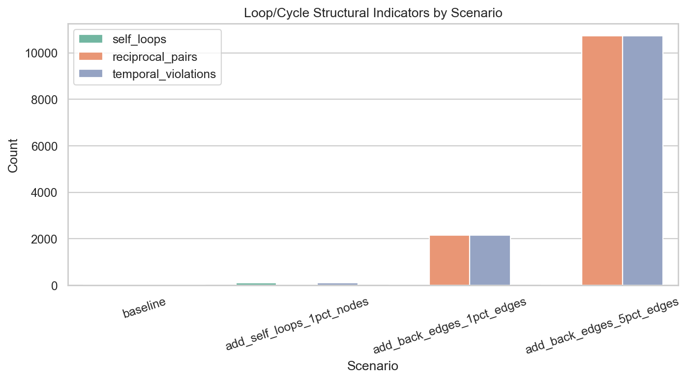
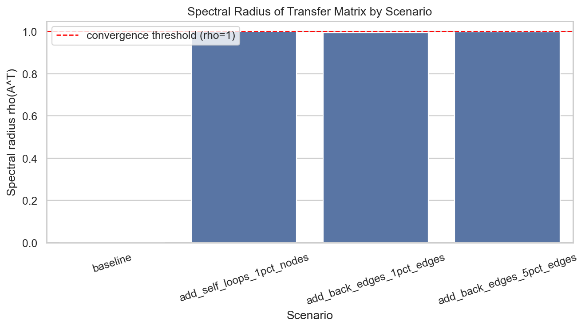

# Ad-hoc Analysis: Loop Treatment and Impact on Large Synthetic Graphs

## Scope
This report analyzes how loops are treated in the synthetic graph pipeline and quantifies their impact on a large synthetic graph (`10K` nodes).

Analyzed graph artifact:
- `data/synthetic_10K/10K_citation_edges.txt`

Analysis script used:
- `analyses/loop_impact_large_synthetic_analysis.py`

---

## How loops are treated in the code

### 1) Self-loops and temporal loops during generation
In synthetic generation, each source node can only cite earlier nodes:
- `generators/generate_synthetic_graph.py` (`_generate_edges`), line with `valid_targets = list(range(source))`

This implies:
- no self-loop (`source -> source`) is possible,
- no forward-in-time edge (`source -> target >= source`) is possible,
- generated graph is DAG by construction in node-id temporal order.

### 2) Duplicate loops/edges
Neighbors are stored in sets in graph structure:
- `graph/GraphUtils.py` (set-based adjacency)

This naturally deduplicates repeated edge insertions.

### 3) Credit-transfer convergence assumptions
Credit transfer explicitly expects either:
- DAG structure, or
- cyclic graph with contractive cycles.

See:
- `credit/generalFormulation.py` (module doc and `check_convergence` spectral-radius check).

---

## Experimental setup (ad-hoc)

Starting from the generated large graph (`10K` nodes), four scenarios were evaluated:

1. **baseline**: original generated graph.
2. **add_self_loops_1pct_nodes**: inject self-loop on 1% of nodes.
3. **add_back_edges_1pct_edges**: inject reverse edge for 1% of existing edges.
4. **add_back_edges_5pct_edges**: inject reverse edge for 5% of existing edges.

For each scenario we measured:
- `self_loops`
- `reciprocal_pairs` (2-cycles)
- `temporal_violations` (`source <= target`)
- transfer-matrix spectral radius `rho(A^T)`
- convergence proxy (`rho < 1`)

---

## Results

| Scenario | Nodes | Edges | Self-loops | Reciprocal pairs | Temporal violations | Spectral radius | Converges (`rho<1`) |
|---|---:|---:|---:|---:|---:|---:|---|
| baseline | 10,000 | 214,661 | 0 | 0 | 0 | 0.000000 | True |
| add_self_loops_1pct_nodes | 10,000 | 214,761 | 100 | 0 | 100 | 1.000000 | False |
| add_back_edges_1pct_edges | 10,000 | 216,807 | 0 | 2,146 | 2,146 | 0.994020 | True |
| add_back_edges_5pct_edges | 10,000 | 225,394 | 0 | 10,733 | 10,733 | 0.998233 | True |

Raw table:
- `analyses/loop_impact_report/tables/loop_impact_scenarios.csv`

---

## Plots

### Loop/cycle indicators


### Spectral radius impact


---

## Interpretation

1. **Current generator strongly suppresses loops by design**
   - Baseline has exactly zero self-loops, zero reciprocal pairs, zero temporal violations.
   - This confirms loop-free generation in temporal order.

2. **Self-loops are the most dangerous perturbation for convergence**
   - Injecting only 100 self-loops (1% nodes) drives `rho` to ~1 and breaks strict `rho < 1` convergence condition.
   - In this model, self-loops can trap/recirculate credit and make the fixed-point solution unstable or borderline.

3. **Back edges (2-cycles) are also risky but less immediately catastrophic**
   - At 1% and 5% injected reversals, `rho` increases close to 1 (`0.994`, `0.998`), indicating high sensitivity.
   - The system still passes `rho < 1`, but with a much smaller safety margin.

4. **Large graphs are especially sensitive to loop introduction**
   - Even sparse loop/cycle injection shifts spectral behavior sharply toward the convergence boundary.

---

## Practical implications

- For robust credit-transfer experiments on large synthetic graphs, keep the loop-free temporal constraint.
- If future experiments intentionally allow cycles, add explicit cycle controls (or damping) and monitor `rho(A^T)` per run.
- Treat self-loops as high-risk edges; even low prevalence can materially change convergence properties.

---

## Reproduce

```bash
python3 analyses/loop_impact_large_synthetic_analysis.py
```

Outputs are written to:
- `analyses/loop_impact_report/tables/`
- `analyses/loop_impact_report/plots/`

