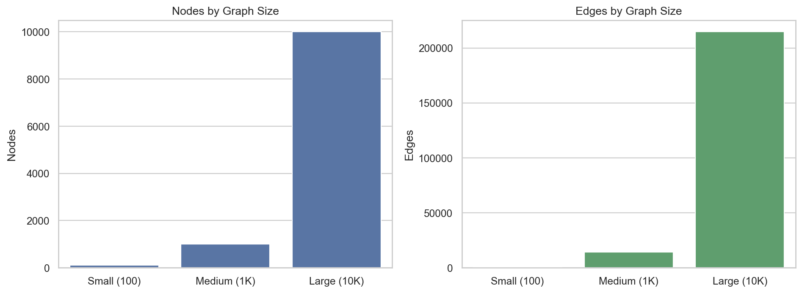
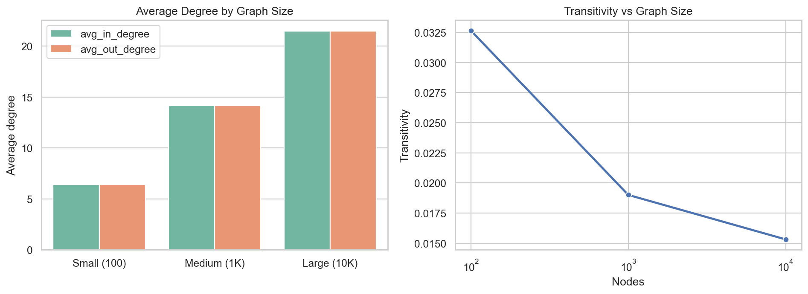
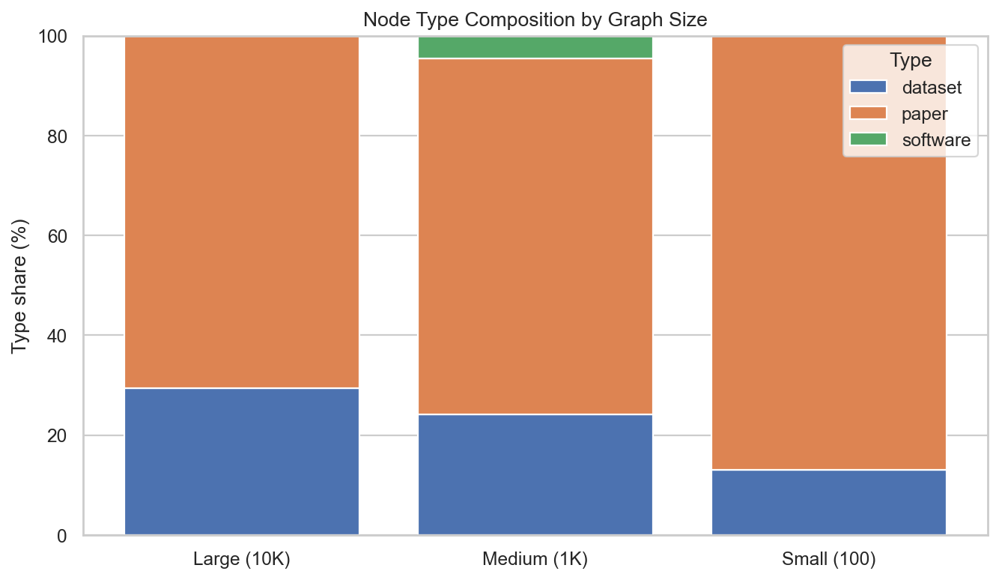

# Synthetic Graph Size Experiments Report

## Objective
Evaluate how synthetic citation graph properties change with graph size using the project generator and standard configuration files.

The experiments compare three graph scales:
- **Small (100 nodes)** using `config/synthetic_small.properties`
- **Medium (1K nodes)** using `config/synthetic_citation.properties`
- **Large (10K nodes)** using `config/synthetic_10K.properties`

## Experimental Setup
- Generator: `generators/generate_synthetic_graph.py`
- Runner script: `analyses/synthetic_graph_size_experiments.py`
- Seeds from config files are fixed (`123`, `42`, `999`) for reproducibility.
- For each size, the generator creates a DAG citation graph with:
  - power-law-like in-degree behavior,
  - exponential out-degree sampling,
  - community-aware edge creation,
  - transitivity-driven triangle closure,
  - type-aware citation preferences,
  - synthetic authorship assignments.

## Main Results

### 1) Structural Summary by Size

| Experiment | Nodes | Edges | Density | Avg In-Degree | Max In-Degree | Transitivity | Types | Authors | Avg Authors/Node |
|---|---:|---:|---:|---:|---:|---:|---:|---:|---:|
| Small (100) | 100 | 643 | 0.06495 | 6.43 | 58 | 0.03265 | 2 | 50 | 1.9100 |
| Medium (1K) | 1,000 | 14,160 | 0.01417 | 14.16 | 565 | 0.01901 | 3 | 300 | 2.5770 |
| Large (10K) | 10,000 | 214,661 | 0.00215 | 21.4661 | 5,930 | 0.01531 | 2 | 3,000 | 3.0203 |

### 2) Node Type Composition

| Experiment | Type | Count | Share (%) |
|---|---|---:|---:|
| Small (100) | paper | 87 | 87.00 |
| Small (100) | dataset | 13 | 13.00 |
| Medium (1K) | paper | 712 | 71.20 |
| Medium (1K) | dataset | 242 | 24.20 |
| Medium (1K) | software | 46 | 4.60 |
| Large (10K) | paper | 7,061 | 70.61 |
| Large (10K) | dataset | 2,939 | 29.39 |

## Plots

### Nodes and Edges by Size


### Degree and Transitivity by Size


### Type Composition by Size


## Interpretation

1. **Density decreases with scale**
   - Edge count grows with size, but possible edge pairs grow much faster.
   - Observed density drops from `0.06495` (100 nodes) to `0.00215` (10K nodes), matching sparse citation-network behavior.

2. **Average degree increases while sparsity is preserved**
   - Avg degree increases from `6.43` to `21.47` as configured out-degree targets increase by size profile.
   - This produces richer connectivity at larger scale without creating dense graphs.

3. **Heavy-tail behavior strengthens at larger size**
   - Max in-degree rises sharply (`58` -> `565` -> `5930`), consistent with preferential citation accumulation.

4. **Transitivity declines moderately with size**
   - Transitivity decreases (`0.03265` -> `0.01901` -> `0.01531`).
   - Larger graphs dilute local clustering while still preserving non-zero triangle closure.

5. **Authorship complexity grows with scale**
   - Average authors per node rises (`1.91` -> `2.58` -> `3.02`).
   - This increases multi-author credit interactions in larger synthetic benchmarks.

## Artifacts Produced

### Tables
- `tables/synthetic_graph_size_summary.csv`
- `tables/synthetic_graph_type_distribution.csv`

### Plots
- `plots/nodes_edges_by_size.png` and `.pdf`
- `plots/degree_transitivity_by_size.png` and `.pdf`
- `plots/type_composition_by_size.png` and `.pdf`

### Script
- `analyses/synthetic_graph_size_experiments.py`

## Reproduction
Run the experiment script:

```bash
python3 analyses/synthetic_graph_size_experiments.py
```

Outputs are written under:
- `analyses/synthetic_size_report/tables/`
- `analyses/synthetic_size_report/plots/`

## Notes
- Size-based comparisons intentionally use one config per scale.
- The 10K comparison uses `synthetic_10K` (2 types) rather than `synthetic_large` (also 10K, 3 types), to avoid confounding size with additional type-model changes.
- If needed, a follow-up experiment can compare the two 10K configs directly as a controlled "same-size, different semantics" study.

